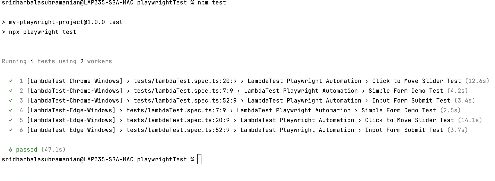

# Playwright Automation Assessment - LambdaTest

## Overview
This project is a Playwright-based automation suite designed to validate functionalities on the LambdaTest Selenium Playground. The assessment required implementing test cases for three scenarios while ensuring parallel execution and cloud-based test execution using LambdaTest.

## Implemented Test Cases
### 1. Simple Form Demo Test
- Navigates to the "Simple Form Demo" page.
- Enters a predefined message in the input field.
- Clicks the "Show Message" button.
- Validates that the displayed message matches the input.

### 2. Click to Move Slider Test
- Navigates to the "Drag & Drop Sliders" page.
- Identifies the correct slider element.
- Retrieves the initial slider value.
- Clicks at a calculated X position to move the slider towards **95**.
- Validates that the final slider value is **95**.

### 3. Input Form Submit Test
- Navigates to the "Input Form Submit" page.
- Attempts to submit the form without filling fields to capture validation errors.
- Fills out the form with valid input data.
- Submits the form.
- Waits for the success message to appear.
- Validates that the success message matches the expected text.

## Parallel Execution Setup
We configured Playwright to run tests in parallel across different browser environments:
- **Google Chrome (Windows 10)**
- **Microsoft Edge (Windows 10)**

Playwright’s `defineConfig` was modified to use two workers and retry failed tests twice when running in CI environments.

## Execution Environment
Tests are executed on LambdaTest using WebSocket connections, enabling cloud-based browser automation. The configuration includes:
- **Parallel Execution**: Two workers running tests concurrently.
- **Cloud Execution**: Using LambdaTest’s Playwright grid.
- **Video, Console, and Network Logging**: Enabled for debugging.

## How to Run the Tests
### Prerequisites
- Node.js installed
- Playwright installed (`npm install @playwright/test`)
- LambdaTest credentials set in environment variables:
  ```bash
  export LT_USERNAME=your_username
  export LT_ACCESS_KEY=your_access_key
  ```

### Running the Tests
To execute the test suite, use:
```bash
npm test
```
This will:
1. Run all test cases in parallel across Chrome and Edge.
2. Log the results to the terminal.
3. Generate videos and logs (available on LambdaTest dashboard).

## Key Implementation Highlights
- **Optimized Slider Movement**: Instead of dragging, we used precise clicking to move the slider efficiently.
- **Cloud-Based Execution**: Leveraged LambdaTest for distributed browser testing.
- **Parallelism**: Configured multiple workers to execute tests simultaneously.
- **CI-Ready Configuration**: Supports retries in CI/CD pipelines.

## Assessment Compliance
All test cases are implemented as per the assignment requirements. The solution ensures:
- Correct validation of input fields.
- Proper UI interaction with the slider.
- Parallel execution on supported browsers.
- Cloud-based execution on LambdaTest.

## Screenshot



## Test IDs

- MHOME-PNLO0-PTNYW-TTSU6
- EOWO6-EFFFA-NM9QA-0RGON
- JDV11-YAZTT-5R8YB-J9G9M
- CXEVP-QUQNC-O2H7Z-NAVTJ

---
**Author**: Sridhar Balasubramanian  
**Date**: February 2025


